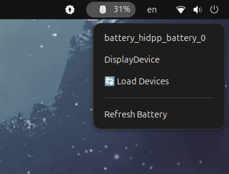

# Mouse Charge Extension

GNOME Shell extension that displays the battery charge of your wireless mouse in the top panel.

## Features

- 🖱️ Shows real-time mouse battery percentage in the top panel
- 📱 Supports multiple input devices
- 🔄 Auto-refreshes every 30 seconds
- 💾 Saves selected device to `device.config`
- 🎯 Easy device switching from the dropdown menu

## Usage

1. Click on the mouse icon in the top panel to open the menu
2. Select "Load Devices" to see available devices
3. Choose your mouse device from the list
4. The selected device will be saved and automatically loaded on next startup
5. Use "Refresh Battery" to manually update the battery status

## Interface

The extension provides a clean popup menu with:
- Current device name display
- Load Devices button to discover all connected devices
- Device selection menu
- Refresh Battery button for manual updates

## Technical Details

- Uses `upower` command to query device battery information
- Configuration stored in `~/.local/share/gnome-shell/extensions/mouse-charge@github.com/device.config`
- Python scripts handle device discovery and battery status queries
- Periodic updates every 30 seconds with manual refresh option

## Files

- `extension.js` - Main extension code
- `charge_info.py` - Battery information retrieval script
- `checker_device.py` - Device discovery script
- `device.config` - Configuration file storing selected device
- `metadata.json` - Extension metadata
- `stylesheet.css` - UI styling
